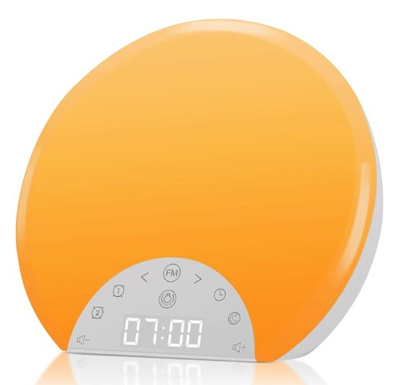
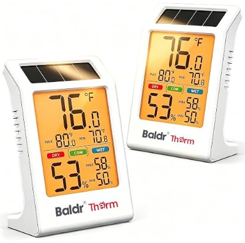
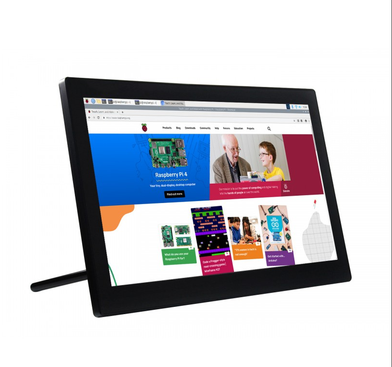
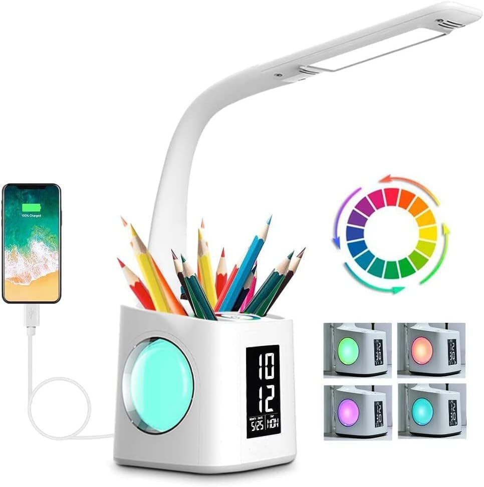

## Voice of the Customer Benchmarking

### Search #1

**Keywords:** "Dorm Room Gadgets"

**Search Results Link:** [Search Results Link](https://www.amazon.com/s?k=dorm+room+gadgets&i=garden&crid=Q74A4EAKDE0U&sprefix=dorm+room+gadget%2Cgarden%2C257&ref=nb_sb_noss_1)

### Selected Products

#### 1. [ANTDALIS Sunrise Alarm Clock](https://www.amazon.com/dp/B09YPNMWQ1?linkCode=ogi&tag=opr-lift-20&ascsubtag=%5Bartid%7C10072%5Bsrc%7Cmgu_ga_opr_md_bm_comm_org_us_g40929131&asc_source=google&asc_campaign=mgu_ga_opr_md_bm_comm_org_us_g40929131&asc_refurl=https%3A%2F%2Fwww.oprahdaily.com%2Flife%2Fg40929131%2Fdorm-room-essentials%2F) < (link to the product)

* Price: $39.99

* Vendor: jinnuoenergy

* Description:About this item
【Wake Up Light with Sunrise Simulation】 This wake up light gradually increases within 30 minutes from soft morning Red to Orange until your room is filled with bright white light. By the time light has filled the room your preset natural sound wakes you up naturally, getting you ready for the day ahead. You can also set a sunrise lamp without sound to wake you or kids up in a more natural way.
【Dual Alarm Clock with Tap To Snooze】 This sunrise alarm clock has 2 alarms, which includes 7 natural sounds and 10 sound volume. We also specially designed the snooze function for those who needs the extra 9 minutes sleep by tapping the "Snooze" button at the top of this loud alarm clock, up to 10 times, it is a perfect alarm clock for heavy sleepers adults and kids.
【Sleep Aid with 7 Sleep Sounds】 This natural light alarm clock glows a soft night light and/or plays natural sound (7 sounds) with an auto- off timer (30Mins-12Hrs) to help you or kids fall asleep more peacefully. You can also adjust clock display brightness or turn it off, if you turn it off, it will return to the third brightness level when dual alarm clock work in next morning.
【8 Color Light & White Light & FM Radio】 This sunlight alarm clock includes 8 color light and 3 warm white light, and support stepless dimming control (500lux @35cm). It's perfect as a bedside lamp, baby nursery lamp, romantic atmosphere lamp and reading lamp. It also supports automatic scan of radio channels with a frequency of 76-108 MHz and will save them, provides you the latest news and interesting program.
【Easy To Use User Interface】 Unlike the common wake up sunrise alarm clock which is complicated to operate, this natural light alarm clock integrated all setting buttons on a visible touch controlled panel, which is a aesthetic and minimalist design, easy to use. 100% Satisfaction Guarantee, we will offer free replacement for your dissatisfied orders.

##### Positive Comments

| Voice of the Customer                                                                                                                                                                  | Restated Customer Need                                                              |
| -------------------------------------------------------------------------------------------------------------------------------------------------------------------------------------- | ----------------------------------------------------------------------------------- |
| "I really love this clock. I've had it for over a year, it works great. It slowly wakes you up, instead of jarring you out of your sleep. Has some good sound options, instead of the blaring alarm. I also like that the time can be unlit during the night, so you don't get the glare of the clock numbers shining in your face all night, that can disrupt your sleep."| 1.  The clock is reliable. (explicit)
| "We love this alarm clock! It makes it feel like the sun is rising, only at whatever time you want it to rise. The "sunrise" starts 30 minutes before the alarm goes off, we didn't realize that, but we like it, and it gradually gets brighter. You can adjust the intensity of the light, which is also a plus, so if you only need some light, or you need full on white light, you can have either! Then, when the alarm goes off, you have multiple sound options to choose from, the sound starts out low and gets louder as well. I purchased this for my collegebound child, this will "turn the lights on" for her before she has to get out of bed" | 2.  The clock worked for year without failure. (explicit) |
| "I’m very excited about this alarm, there was another brand that I have had but there updated model took away some of my favorite features! This has them! I would say so far so easy to set up clock and alarms." |  3.  The clock birghtness is adjustable. (explicit)      |

##### Negative Comments

| Voice of the Customer                                                                                                                                                                                                                                                                                                                                                                                | Restated Customer Need                                  |
| ---------------------------------------------------------------------------------------------------------------------------------------------------------------------------------------------------------------------------------------------------------------------------------------------------------------------------------------------------------------------------------------------------- | ------------------------------------------------------- |
| "Does not have battery reserve. No push buttons make it so annoying to use especially when in bed. The clock light so so bright on its lowest setting I had to tape over it. It works fine minus the power outage part but I would not recommend." | 1.  The clock has no battery backup. (explicit) 
| "Parou de funcionar em menos de 1 mês de uso. Tentei contato com o vendedor via Amazon e não obtive resposta." | 2.  The clock is not reliable.(explicit) |
|        "It was easier than I thought to setup. Initially, it worked well. The interval between the alarm starting and at full brightness is good. It's bright enough and loud enough, but I started noticing in the first couple of weeks that the alarm wasn't going off. (I bought this for my son) I'd check the alarm thinking we forgot to set it, but it was set. At first, it was once every other week or so. Over the next few months, I noticed this issue increase to it happening a couple times a week. This obviously defeats the purpose of an alarm clock. It drove me crazy thinking we either forgot to set the alarm or my son was getting up as soon as it goes off and turning it off before the volume was loud enough to hear. After trying to fix the issue unsuccessfully, I decided to watch the clock right before it was set to go off... and it didn't go off. It did nothing. And it was set! For the correct time! The last straw was when it starting flashing red in the middle of the night. That was creepy. Anyway, It's been 4 months now, so we can't return it. I can only inform others to be aware of potential issues. I will say, a feature I found when troubleshooting the issues of the gas-lighting alarm clock is that the clock kept the time and alarm settings after being unplugged and plugged back in ( no batteries). Whatever kind of sorcery that was, it saved me the hassle of setting it up again."  | 3.  The clock is easy to set up. (explicit)           |

#### 2. [BALDR 2-Pack Indoor Thermometer Humidity Meter](https://www.amazon.com/gp/aw/d/B0GVN1NSTY?pd_rd_plhdr=t&hsa_cr_id=0&qid=1788919390&sr=1-1-5a5562f9-fdfd-4101-9f9d-d76aa9998432&i=aps&aref=sowZzQowuU&_encoding=UTF8&ref_=sbx__sbtcd2_asin_0_title&pd_rd_w=LtTg9&content-id=amzn1.sym.90f77631-9599-4fe0-95f8-a40adfe1c762%3Aamzn1.sym.90f77631-9599-4fe0-95f8-a40adfe1c762&pf_rd_p=90f77631-9599-4fe0-95f8-a40adfe1c762&pf_rd_r=WXBC1SR3S0HZJSM0F7CS&pd_rd_wg=evvis&pd_rd_r=23a7589a-9687-4abd-980f-aa2221349390&th=1) < (link to the product)

* Price: $24.99

* Vendor: Advanced NO.1

* Description:About this item
𝗦𝗢𝗟𝗔𝗥-𝗣𝗢𝗪𝗘𝗥𝗘𝗗 𝗪𝗜𝗧𝗛 𝗕𝗔𝗧𝗧𝗘𝗥𝗬 𝗦𝗨𝗣𝗣𝗟𝗬- Say goodbye to constant battery swaps. Our innovative solar powered indoor thermometer harnesses available light to power the thermometer when light is present, and automatically switches to the built-in battery when it is dark. This efficient low-power design significantly extends power life, providing a sustainable and reliable hygrometer solution for your home
𝗡𝗢 𝗦𝗘𝗧𝗨𝗣 𝗥𝗘𝗤𝗨𝗜𝗥𝗘𝗗, 𝗡𝗢 𝗕𝗔𝗧𝗧𝗘𝗥𝗬 𝗥𝗘𝗣𝗟𝗔𝗖𝗘𝗠𝗘𝗡𝗧 𝗡𝗘𝗘𝗗𝗘𝗗- Ready to use out of the box-no apps, no WiFi, no settings, and no battery replacement needed. A clean, modern indoor thermometer that blends naturally into any room
𝗣𝗥𝗢𝗙𝗘𝗦𝗦𝗜𝗢𝗡𝗔𝗟 𝗦𝗘𝗡𝗦𝗢𝗥 𝗔𝗖𝗖𝗨𝗥𝗔𝗖𝗬- Get data you can trust. Indoor temperature ranges from 14.2°F to 122°F , and humidity from 1% to 99%. Engineered with high-precision sensors, this temperature monitor delivers accuracy within +/-0.9°F and 3% RH for sensitive environments like plant greenhouses, wine cellars, or guitar rooms
𝗦𝗢𝗙𝗧 𝗕𝗔𝗖𝗞𝗟𝗜𝗚𝗛𝗧 𝗙𝗢𝗥 𝗡𝗜𝗚𝗛𝗧𝗧𝗜𝗠𝗘 𝗖𝗟𝗔𝗥𝗜𝗧𝗬-No more fumbling in the dark. A simple press of the dedicated button activates a soft backlight, making this room thermometer easy to read at night without disturbing your sleep. 3.2 inch upgrade LCD display ensures clear visibility from a distance. NOTE: We recommend that you pull out the transparent tab at the bottom before pressing the backlight button
𝗦𝗠𝗔𝗥𝗧 𝗠𝗔𝗫/𝗠𝗜𝗡 & 𝗖𝗢𝗠𝗙𝗢𝗥𝗧 𝗧𝗥𝗔𝗖𝗞𝗜𝗡𝗚-Stay ahead of environmental shifts. This humidity gauge automatically tracks 24-hour max min records with a simple 2-second clear bottom. The main unit refreshes every 10 seconds, so you always get near real-time data. Combined with intuitive DRY/COM/WET icons, you can instantly decide when to adjust your air quality
𝗖𝗢𝗠𝗣𝗔𝗖𝗧 𝗗𝗘𝗦𝗜𝗚𝗡 𝗙𝗢𝗥 𝗘𝗩𝗘𝗥𝗬 𝗦𝗖𝗘𝗡𝗘- Built for versatility. Whether on a nightstand or wall-mounted, this digital hygrometer fits seamlessly into any decor. With quick F/C switching, it's a must-have house thermometer for nurseries, offices, and indoor gardens

##### Positive Comments

| Voice of the Customer                                                                                                                                                                  | Restated Customer Need                                                              |
| -------------------------------------------------------------------------------------------------------------------------------------------------------------------------------------- | ----------------------------------------------------------------------------------- |
| "These are great. I bought 2 packs, thinking I only ordered 2. I gave away two. All 4 read within 1 degree of each other. Would highly recommend"| 1.  The device is accurate. (explicit)
| "I really like these. Doesn’t take up much space. It was worth what I paid for it" | 2.  The device is easy to use. (explicit) |
| "They are easy to use, accurate, and I love that they’re solar-powered. Perfect for keeping track of the temperature and humidity in different rooms. Highly recommend!" |  3.  The device is easy to use. (explicit)      |

##### Negative Comments

| Voice of the Customer                                                                                                                                                                                                                                                                                                                                                                                | Restated Customer Need                                  |
| ---------------------------------------------------------------------------------------------------------------------------------------------------------------------------------------------------------------------------------------------------------------------------------------------------------------------------------------------------------------------------------------------------- | ------------------------------------------------------- |
| "It doesn’t glow unless you push a button on it’s back which is impossible to see in dark." | 1.  The device is difficult to use. (explicit) 
| "Received these 1 week ago. Pulled the plastic tabs from both, set them both near a window with natural light and left for a trip. I’ve come back and only one of them is working. The other is dead" | 2.  The devide is not reliable.(explicit) 
|        "Received these 1 week ago. Pulled the plastic tabs from both, set them both near a window with natural light and left for a trip. I’ve come back and only one of them is working. The other is dead"  | 3.  The device does not work. (explicit)           |

### Selected Products

#### 3. [Waveshare 13.3 Magic Mirror Mini-Computer](https://www.robotshop.com/products/133in-cm4-magic-mirror-mini-computer-speech-assistant-touch-w-o-cm4-us?gad_source=1&gad_campaignid=20145188159&gbraid=0AAAAAD_f_xwbk9lAG88qNODr5XLnw3hDg&gclid=CjwKCAjwtp7VBhBjEiwAJfpV-4KuWFTn92Vl-OTcXuFsh9mMMgr4Co0J9_gJI1ezlz-qQnJJ1UrmPhoCbLUQAvD_BwE)

*Price: $233.02

*Vendor: RobotShop inc.

*Description: About this Item  
[Embedded Raspberry Pi CM4] This is the brain of the computer which will handle all the user code and will allow them to pick ans choose what they want on the screen
[IPS Display 1920x1080] This is the screen of the device where everything will post and display the users personalized set up. The resolution provides a clear and high definition picture to 
[Toughened Glass Captive Touch Panel] This is the main way to interact with the device and supports up to 10-point touch which will provide a smooth interaction with the device
[One Way Mirror] The device is multifunctional and will also work as a mirror while inactive or you can have both functions running at once
[Embedded Microphone and Speaker] The device is supported by Google Assistant so the user can use the embedded microphone to speak/command the device. The dual track Ferrite Hi-Fi speakers allow the user to hear the Google AI and other media such as music 

##### Positive Comments

| Voice of the Customer                                                                                                                                                                  | Restated Customer Need                                                              |
| -------------------------------------------------------------------------------------------------------------------------------------------------------------------------------------- | ----------------------------------------------------------------------------------- |
|"Finitions plus que moyennes, malgré une bonne qualité d'image" | 1. The screen on the device is good quality (explicit)  
|"Muy buena resolución!" | 2. The resolution of the screen is nice (explicit)  
|"Erfüllt im Wesentlichen meine Erwartungen Der Monitor erfüllt im Wesentlichen die Erwartungen, die ich im Vorfeld des Kaufes hatte. Er reißt niemanden vom Hocker, aber funktioniert und tut was er soll. pro: - Gutes scharfes Bild - funktionierte tatsächlich plug&play unter Windows 10, auch die Touch-Funktion - Kabeleinführung ist etwas gekapselt = Schutz der Kabel - diverse VESA-Aufhängemöglichkeiten zum Anbringen von Halterungen - Aus-/Anschalter sowie einige andere Schalter an der Rückseite vorhanden contra:- sehr starke Lichthöfe bei dunklem Bild Stützständer nicht in der Position verstellbar" | 3. The device works just as the customer expected

##### Negative Comments

| Voice of the Customer                                                                                                                                                                  | Restated Customer Need                                                              |
| -------------------------------------------------------------------------------------------------------------------------------------------------------------------------------------- | ----------------------------------------------------------------------------------- |
|"Got it for my mom, but she couldn’t figure out how to change the display orientation. Instructions are unclear." | 1. Instruction are too complicated to follow or unclear (explicit)
|"Okay, it’s flashy and kinda smart, but the touch response is hit or miss. Sometimes it doesn’t register my swipe. Annoying." | 2. Screen doesn't register some touches (explicit)
|"The screen is nice, but setup was a nightmare. Took me 3 days to get the voice assistant working. Also, the touch isn’t always responsive." | 3. Microphone doesn't always pick up customer voice (explicit)

#### 4. 

### Search #5
#### 5. [7-in-1 Study Desk Lamp](https://www.amazon.com/dp/B074J4YNGF/?tag=dqmedia-20)

**Keywords:** "multi-use lamp"

**Search Results Link:** [Search Results Link](https://www.amazon.com/dp/B074J4YNGF/?tag=dqmedia-20)

* Price: $21.75

* Vendor: ERAY

* Description: Multi-functions : 7 in 1, desk lamp with USB charging port, 256 color changing base, pencil holder, clock, calendar and LCD screen, it meets all your requirements.
USB Port: Output 5V/2A USB charging port,so you can spend less time to remain full electricity for your mobile device.(Iphone, samsung or power bank)
Colorful light: Touch the spectrum ring to adjust 256 color changing base, create any variety of atmosphere at the night. If hold down the spectrum ring for 2 seconds, the color would cycle automatically, now you can color your night and life with this magic lamp.
Best gift for children: Large capacity pencil holder can also help you to place something, dimmable reading lamp with 3-Levels of brightness, suitable for students to use as a led desk reading light.

#### Positive Comments

| Voice of the Customer                                                                                                                                                                  | Restated Customer Need                                                              |
| -------------------------------------------------------------------------------------------------------------------------------------------------------------------------------------- | ----------------------------------------------------------------------------------- |
|I have bought couple of led lamps in the past few years. This lamp is my favorite. The following is why I like it 1)brightness adjustment by simply tapping the button in center. The light is bright enough in my working area and most importantly my eyes feel very comfortable under its light no matter I read books, work on a laptop or scratch on a paper. 2) multipurpose: it serves as a lamp of course. It also serves as a pen holder so that I can get rid of my old pen holder to make the table very clean. It also has a clock, date and thermometer. I don't need my phone anymore to check time when I'm reading. The clock has its own backlight which can be turned on and off. It is equipped with a USB charger as well. Its output current is 2A instead of 1A in my other lamps with USB. larger output current reduces the charging time for devices with large battery such as IPAD. 3) The colorful night light is quite interesting. Its color can be changed by circling the center button. My son loves playing with it. This lamp is really a piece of work. it does not just light my room. it make my room beautiful.|1.Comfortable light for reading and working (explicit)
|I purchased this for my daughter and her dorm room in May. She took it to school for her summer session and it was the best lamp ever! 3 brightness levels of the lamp, multiple color setting of the glow lights and a clock. She kept it on her dorm desk to hold her pens and have a work lamp. Unfortunately the lamp stopped working after her 6 weeks of summer session and past the return date Amazon sets. Amazon was awesome and put me in contact with the seller directly who immediately rectify the issue sending out a new lamp. This lamp is super cool and for the price you do expect it to last longer than six weeks, therefore superior customer service is vital and that is exactly what I got. I will update this review if the replacement stops working in a short amount of time. I did test it before sending it to my daughter and it works beautifully so time will tell.|2.Good lamp for dorm desk(explicit
|This lamp was wonderful, and we would have liked to have kept it. However, the alarm feature was a deal breaker. It was purchased primarily as a reading lamp and alarm clock. We found that all the controls for the alarm are on the bottom of the lamp. This would be fine if there was a snooze or cancel feature available on the top for the mornings. There was simply no way my wife would be happy with lifting the lamp every morning, blurry eyed, while trying to find the snooze button. It's a shame because every other aspect of the lamp is really cool.|3.Want snooze/cancel on top of lamp (explicit)

#### Negative Comments

| Voice of the Customer                                                                                                                                                                  | Restated Customer Need                                                              |
| -------------------------------------------------------------------------------------------------------------------------------------------------------------------------------------- | ----------------------------------------------------------------------------------- |
|The lamp part is very bright and it looks cool. However, the digital clock is very dim. It works but it’s not easily visible in day light. We changed the battery but it didn’t change the brightness. The clock only works by battery but the lamp works by plug.| 1. Clock display should be bright and easily visible in daylight (explicit)
|Total waste of money I have it in a camper when to use it all at work was light it was insufficient to charge anything on the USB it was too slow for anything to charge the time ran fast and now all it does blank I can't keep time or anything I tried to get it exchanged but I live in a rural part of the area nearest place is 30 miles from here which I can't get to so I'm afraid I'm stuck with it the light works though LOL|2. USB charger was too slow(explicit)
|Cons: Alarm controls are on the bottom of the lamp. Too hard to find in the dark. No, turning on the lamp doesn't help--they are on the BOTTOM. USB port worked poorly--connection was loose so can't use it. Sometimes the light does not shut off when you tap the switch. Overall, poorly designed and does not work well. Pros: still use it for a bedside reading lamp, like the flexible neck. Other than that, it does not do what I purchased it for: an extra charging port and an alarm clock. Don't buy it.|3. Too hard to find controls(explicit)

## Organized Need Statements

### First Placement

### Grouped with categories

### Ranked

## Compiled list of user Needs

1. Students need products that work consistently every day.
2.	Students need products that are easy to set up without technical expertise.
3.	Students need products that fit comfortably in small dorm rooms.
4.	Students need products that are durable and last for years.
5.	Students need products that provide good value for their budget.
6.	Students need adjustable brightness for different activities.
7.	Students need products that are simple enough for first-time users.
8.	Students need reliable charging for their devices.
9.	Students need products that maximize limited desk space.
10.	Students need lighting that is bright enough for studying.
11.	Students need dependable alarms that always wake them.
12.	Students need intuitive controls that require little learning.
13.	Students need products with long battery life.
14.	Students need products that continue working after frequent daily use.
15.	Students need products that reduce desk clutter.
16.	Students need products that combine multiple everyday functions.
17.	Students need products that require minimal maintenance.
18.	Students need USB charging options for multiple devices.
19.	Students need products that are stable and do not tip over easily.
20.	Students need clear instructions for setup and operation.
21.	Students need touch controls that respond accurately.
22.	Students need products that are easy to customize.
23.	Students need products that are easy to reposition.
24.	Students need lighting that reduces eye strain.
25.	Students need products that consume little power.
26.	Students need wireless connections that stay reliable.
27.	Students need products that reconnect automatically after interruptions.
28.	Students need products that charge multiple devices simultaneously.
29.	Students need compact products that can be stored easily.
30.	Students need interfaces that are easy to navigate.
31.	Students need products that work immediately after setup.
32.	Students need products that keep accurate time.
33.	Students need products that do not randomly shut off.
34.	Students need products that charge through compatible phone cases.
35.	Students need products that support different study environments.
36.	Students need adjustable viewing angles.
37.	Students need customizable alarm schedules.
38.	Students need customizable lighting preferences.
39.	Students need multiple color temperature settings.
40.	Students need bedside lighting that does not disturb roommates.
41.	Students need products that operate quietly.
42.	Students need clear sound quality.
43.	Students need adjustable speaker volume.
44.	Students need balanced bass and audio clarity.
45.	Students need products that personalize their dorm room.
46.	Students need products with an attractive appearance.
47.	Students need products that create a relaxing atmosphere.
48.	Students need products that complement dorm décor.
49.	Students need products that feel premium.
50.	Students need lighting that evenly illuminates workspaces.
51.	Students need products that save outlet space.
52.	Students need products that work on USB power.
53.	Students need rechargeable products.
54.	Students need charging indicators that clearly show status.
55.	Students need products that retain settings after power loss.
56.	Students need products that are easy to reset.
57.	Students need products with clearly labeled features.
58.	Students need reliable Bluetooth pairing.
59.	Students need easy Wi-Fi setup.
60.	Students need compatibility with smartphones.
61.	Students need compatibility with voice assistants.
62.	Students need products that continue functioning with limited internet.
63.	Students need software updates that do not reduce performance.
64.	Students need products that require little troubleshooting.
65.	Students need sturdy materials.
66.	Students need durable hinges and moving parts.
67.	Students need products that survive transportation between dorms.
68.	Students need products that withstand accidental bumps.
69.	Students need dependable construction quality.
70.	Students need products that justify their purchase price through longevity.
71.	Students need products that fit crowded desks.
72.	Students need products that can adapt to different room layouts.
73.	Students need flexible positioning.
74.	Students need customizable display settings.
75.	Students need products that accommodate different sleep schedules.
76.	Students need alarms that remain active until dismissed.
77.	Students need products that perform consistently every use.
78.	Students need products that do not lose power unexpectedly.
79.	Students need music that does not overpower spoken content.
80.	Students need speakers appropriate for shared living spaces.
81.	Students need decorative lighting options.
82.	Students need products that create a comfortable living environment.
83.	Students need aesthetically pleasing products that remain functional.
84.	Students need products that reduce stress during busy schedules.
85.	Students need products that save time.
86.	Students need products that improve everyday convenience.
87.	Students need products that work as advertised.
88.	Students need accurate product descriptions before purchasing.
89.	Students need responsive customer support.
90.	Students need warranties that provide confidence.
91.	Students need companies that resolve issues quickly.
92.	Students need clear return policies.
93.	Students need products that synchronize correctly with smartphones.
94.	Students need firmware that does not introduce new problems.
95.	Students need products that are easy to maintain over time.
96.	Students need products that minimize cable clutter.
97.	Students need dependable charging indicators.
98.	Students need products that remain stable despite a compact footprint.
99.	Students need products that continue functioning after relocation.
100. Students need products that make dorm living more enjoyable without adding complexity.
