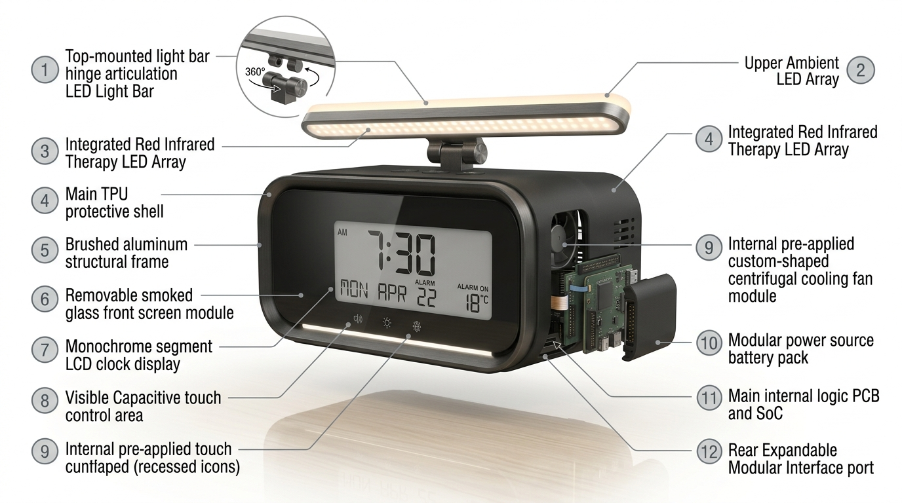

## Intro/overview

This design page was created by first referencing the background materials. They include the course sequesnce requirements, the project description, brainstorming techniques, and successful ideation techniques. After meetings, discussions, writing, and consulting docuements, our team generated the following thoughts and ideas. 

## Generating Ideas

| Requirement/Need                                         | Feature                         | Detail                                                                                                                         |
| -------------------------------------------------------- | ------------------------------- | ------------------------------------------------------------------------------------------------------------------------------ |
| At least one signal input (temp, humidity, light, audio) | Light Sensor                    | Measures ambient light intensity to automatically adjust lighting brightness or operating mode.                                |
|                                                          | Humidity Sensor                 | Measures relative humidity to monitor room conditions and provide input for environmental controls.                            |
|                                                          | Audio Sensor                    | Detects ambient sound levels or audio events for sound-responsive functions.                                                   |
|                                                          | Thermometer                     | Measures ambient temperature to monitor room conditions and provide input for temperature-based controls.                      |
|                                                          | Motion Sensor                   | Detects nearby movement or occupancy to activate lighting, displays, or other functions automatically.                         |
| At least 2 outputs (lighting, clock/screen display, fan) | Mood Lighting                   | Provides adjustable LED lighting with selectable brightness and color settings.                                                |
|                                                          | Clock Display                   | Displays the current time, alarm status, and other relevant system information.                                                |
|                                                          | Fan                             | Provides localized airflow and can be controlled manually or automatically using sensor data.                                  |
|                                                          | Humidifier                      | Adds moisture to the surrounding air when additional humidity is desired.                                                      |
|                                                          | Alarm Lighting                  | Uses flashing, fading, or increasing light intensity as a visual alarm or wake-up indicator.                                   |
| Dual power source                                        | 120V Wall Plug                  | Provides primary power from a standard 120 V AC wall outlet through an appropriate isolated AC-to-DC power supply.             |
|                                                          | Rechargeable Battery Power Pack | Provides backup or portable power when wall power is unavailable.                                                              |
|                                                          | USB Charging                    | Allows the system or internal battery to receive power from a compatible USB power source.                                     |
|                                                          | Wireless Charging               | Allows compatible devices or the product battery to charge without a direct cable connection.                                  |
|                                                          | Solar Charging                  | Provides supplemental battery charging using a photovoltaic panel and appropriate charge-control circuitry.                    |
| Removable modular units                                  | LED Array Easily Removable      | Allows the LED lighting assembly to be removed and replaced without replacing the entire product.                              |
|                                                          | Battery/Charger Pack Cartridge  | Uses a removable battery and charging module for easier replacement, maintenance, or upgrades.                                 |
|                                                          | Power Rectifier External        | Places AC-to-DC power conversion in an external power adapter, reducing high-voltage circuitry inside the main enclosure.      |
|                                                          | Screen Removable                | Allows the display module to be detached for repair, replacement, or future upgrades.                                          |
|                                                          | PCB Card Slide In/Out           | Uses connectors and mechanical guides so the main PCB can be removed without extensive disassembly or rewiring.                |
| Impact resistant                                         | Rounded Edges                   | Reduces sharp impact points and helps distribute forces when the enclosure is bumped or dropped.                               |
|                                                          | Shock-Absorbing Rubber Exterior | Adds an elastomeric protective layer to absorb impact energy and protect internal components.                                  |
|                                                          | Robust Hardware                 | Uses durable fasteners, connectors, supports, and mounting points designed to withstand repeated handling.                     |
|                                                          | Aluminum Frame/Housing          | Provides a rigid enclosure that protects internal electronics while offering improved structural durability.                   |
|                                                          | No Glass                        | Uses impact-resistant alternatives such as polycarbonate or acrylic for transparent surfaces to reduce the risk of shattering. |

## Sort, Rank, and Groups
| Compiled List of User Needs                                                                 | Functions                                                       | Rank |
| ------------------------------------------------------------------------------------------- | --------------------------------------------------------------- | ---: |
| 1. Students need products that work consistently every day.                                 | At least one signal input (temp, humidity, light, audio)        |    1 |
| 2. Students need products that are easy to set up without technical expertise.              | at least 2 outputs (lighting, clock/screen display, fan)        |    2 |
| 3. Students need products that fit comfortably in small dorm rooms.                         | Dual power source                                               |    3 |
| 4. Students need products that are durable and last for years.                              | Removable modular units                                         |    4 |
| 5. Students need products that provide good value for their budget.                         | Impact resistant                                                |    5 |
| 6. Students need adjustable brightness for different activities.                            | Push button interface                                           |      |
| 7. Students need products that are simple enough for first-time users.                      | Dial to change brightness                                       |      |
| 8. Students need reliable charging for their devices.                                       | Familiar interface, few butons and knobs                        |      |
| 9. Students need products that maximize limited desk space.                                 | 2 USB for charging and comms                                    |      |
| 10. Students need lighting that is bright enough for studying.                              | Small footprint                                                 |      |
| 11. Students need dependable alarms that always wake them.                                  | LEDs > 500lumins                                                |      |
| 12. Students need intuitive controls that require little learning.                          | Low power alert                                                 |      |
| 13. Students need products with long battery life.                                          | Dual power source                                               |      |
| 14. Students need products that continue working after frequent daily use.                  | Impact resistant                                                |      |
| 15. Students need products that reduce desk clutter.                                        | Modular design, bulb, batteries, controls, and compute          |      |
| 16. Students need products that combine multiple everyday functions.                        | Wider base                                                      |      |
| 17. Students need products that require minimal maintenance.                                | web page setup via usb                                          |      |
| 18. Students need USB charging options for multiple devices.                                | web page setup via usb                                          |      |
| 19. Students need products that are stable and do not tip over easily.                      | flexible light                                                  |      |
| 20. Students need clear instructions for setup and operation.                               | multispectrum light sources                                     |      |
| 21. Students need touch controls that respond accurately.                                   | blutooth enabled                                                |      |
| 22. Students need products that are easy to customize.                                      | multiple usb charging plugs                                     |      |
| 23. Students need products that are easy to reposition.                                     | small footprint                                                 |      |
| 24. Students need lighting that reduces eye strain.                                         | simple push button setup clock and lights with dial             |      |
| 25. Students need products that consume little power.                                       | turn on with no power switch                                    |      |
| 26. Students need wireless connections that stay reliable.                                  | dual power supply                                               |      |
| 27. Students need products that reconnect automatically after interruptions.                | wireless charging pad                                           |      |
| 28. Students need products that charge multiple devices simultaneously.                     | mood lighting                                                   |      |
| 29. Students need compact products that can be stored easily.                               | html based alarm settings available                             |      |
| 30. Students need interfaces that are easy to navigate.                                     | Capable to turn off all lights for sleep settings               |      |
| 31. Students need products that work immediately after setup.                               | quiet button press with physical feedback                       |      |
| 32. Students need products that keep accurate time.                                         | wide band speakers                                              |      |
| 33. Students need products that do not randomly shut off.                                   | physical speaker volume dial.                                   |      |
| 34. Students need products that charge through compatible phone cases.                      | html based audio customization                                  |      |
| 35. Students need products that support different study environments.                       | custom mood lighting                                            |      |
| 36. Students need adjustable viewing angles.                                                | stamped metal body instead of plastic                           |      |
| 37. Students need customizable alarm schedules.                                             | haptic push button with led flash                               |      |
| 38. Students need customizable lighting preferences.                                        |                                                                 |      |
| 39. Students need multiple color temperature settings.                                      |                                                                 |      |
| 40. Students need bedside lighting that does not disturb roommates.                         |                                                                 |      |
| 41. Students need products that operate quietly.                                            |                                                                 |      |
| 42. Students need clear sound quality.                                                      |                                                                 |      |
| 43. Students need adjustable speaker volume.                                                |                                                                 |      |
| 44. Students need balanced bass and audio clarity.                                          |                                                                 |      |
| 45. Students need products that personalize their dorm room.                                |                                                                 |      |
| 46. Students need products with an attractive appearance.                                   |                                                                 |      |
| 47. Students need products that create a relaxing atmosphere.                               |                                                                 |      |
| 48. Students need products that complement dorm décor.                                      |                                                                 |      |
| 49. Students need products that feel premium.                                               |                                                                 |      |
| 50. Students need lighting that evenly illuminates workspaces.                              |                                                                 |      |
| 51. Students need products that save outlet space.                                          |                                                                 |      |
| 52. Students need products that work on USB power.                                          |                                                                 |      |
| 53. Students need rechargeable products.                                                    |                                                                 |      |
| 54. Students need charging indicators that clearly show status.                             | LED charging indicator                                          |      |
| 55. Students need products that retain settings after power loss.                           | product retains user settings for atleadt 30 days without power |      |
| 56. Students need products that are easy to reset.                                          | clearly labeled reset control/can be used without power         |      |
| 57. Students need products with clearly labeled features.                                   | visible labels or symbols indicating funtion                    |      |
| 58. Students need reliable Bluetooth pairing.                                               | succesfully bluetooth pair in 30 seconds                        |      |
| 59. Students need easy Wi-Fi setup.                                                         | WiFi setup in 5 minutes or less                                 |      |
| 60. Students need compatibility with smartphones.                                           | compatible with IOS or android                                  |      |
| 61. Students need compatibility with voice assistants.                                      | one voice assistant                                             |      |
| 62. Students need products that continue functioning with limited internet.                 | core fucntions operate offline                                  |      |
| 63. Students need software updates that do not reduce performance.                          | updates improve/maintain product performance                    |      |
| 64. Students need products that require little troubleshooting.                             | no more than 1 troubleshooting step                             |      |
| 65. Students need sturdy materials.                                                         |                                                                 |      |
| 66. Students need durable hinges and moving parts.                                          | components withstand atleast 10k operating cycles               |      |
| 67. Students need products that survive transportation between dorms.                       | withstand repeated transportation                               |      |
| 68. Students need products that withstand accidental bumps.                                 |                                                                 |      |
| 69. Students need dependable construction quality.                                          |                                                                 |      |
| 70. Students need products that justify their purchase price through longevity.             | service life at least 3 years                                   |      |
| 71. Students need products that fit crowded desks.                                          | compact                                                         |      |
| 72. Students need products that can adapt to different room layouts.                        | multiple                                                        |      |
| 73. Students need flexible positioning.                                                     |                                                                 |      |
| 74. Students need customizable display settings.                                            |                                                                 |      |
| 75. Students need products that accommodate different sleep schedules.                      |                                                                 |      |
| 76. Students need alarms that remain active until dismissed.                                |                                                                 |      |
| 77. Students need products that perform consistently every use.                             |                                                                 |      |
| 78. Students need products that do not lose power unexpectedly.                             |                                                                 |      |
| 79. Students need music that does not overpower spoken content.                             |                                                                 |      |
| 80. Students need speakers appropriate for shared living spaces.                            |                                                                 |      |
| 81. Students need decorative lighting options.                                              |                                                                 |      |
| 82. Students need products that create a comfortable living environment.                    |                                                                 |      |
| 83. Students need aesthetically pleasing products that remain functional.                   |                                                                 |      |
| 84. Students need products that reduce stress during busy schedules.                        |                                                                 |      |
| 85. Students need products that save time.                                                  |                                                                 |      |
| 86. Students need products that improve everyday convenience.                               |                                                                 |      |
| 87. Students need products that work as advertised.                                         |                                                                 |      |
| 88. Students need accurate product descriptions before purchasing.                          |                                                                 |      |
| 89. Students need responsive customer support.                                              |                                                                 |      |
| 90. Students need warranties that provide confidence.                                       |                                                                 |      |
| 91. Students need companies that resolve issues quickly.                                    |                                                                 |      |
| 92. Students need clear return policies.                                                    |                                                                 |      |
| 93. Students need products that synchronize correctly with smartphones.                     |                                                                 |      |
| 94. Students need firmware that does not introduce new problems.                            |                                                                 |      |
| 95. Students need products that are easy to maintain over time.                             |                                                                 |      |
| 96. Students need products that minimize cable clutter.                                     |                                                                 |      |
| 97. Students need dependable charging indicators.                                           |                                                                 |      |
| 98. Students need products that remain stable despite a compact footprint.                  |                                                                 |      |
| 99. Students need products that continue functioning after relocation.                      |                                                                 |      |
| 100. Students need products that make dorm living more enjoyable without adding complexity. |                                                                 |      |

## Concept Sketches
### Concept 1: Mood & Health Clock

**Overview:** The Mood & Health Clock will provide ambient light and directed light. The device also has a display screen to show temperature, time, date, and alarm clock. The device can provide ambient mood lighting, 360 directed reading light, and IR spectrum LED lighting for added health benefits and relaxation. The mood lighting can be customized, allowing for automatic on/off functions based on the ambient light in the room.The device has a modular design with robust materials and construction. The result is a tough and durable machine that is easy to repair. Each component can be removed and replaced with no tools required.

**Target Audience & Venue:** This product is best marketed to students or those needing bedside or table top reading lights. Health and wellness are a common interest for all age groups. Both tech savy and not will enjoy this product as it is very easy to use. 

**Key Problems Solved:** One sensor input and two ouputs are used in this device, meeting the design standards for the product. They are photosensors, LED lights, and time/date display. The device is modular and built to withstand physical damage, which makes it reliable. All 5 needs have been met with this design: 1 input, 2 outputs, dual power source, modular units, impact resistant. 

### Concept 3: Dorm Hub Clock and Weather Helper
#### Description & User Interaction

**Overview:** This design aims to help students who live inside the ASU dorms with keeping up to date with assinment deadlines, create a healthy sleep schedudle or wake up routine, along with a weather forecast display to allow them to prepare for their walk to class. 

**Target Audience & Venue:** The target audience for this product is ASU dorm students who have hard time keeping up with upcoming due dates or the weather forcast before walking to class.

**Key Problems Solved:** IInsert core problems solved]
####
Visual Model

*Figure 5: Annotated CAD model of Concept 3 with callout arrows.*

## Step 5: Documented Work

Participants: Dahryl Williams, Chris Plumely

How we met: In person on polytechnic campus (student union)

How we collected ideas: We split them and typed  them in a google excel sheet. We used the functions to talk and create some ideas and put them in google excel. Each idea has similar elements with different needs that are executed.

Project assignments: We used the user needs benchmarking to create the functions and based some of the needs product requirements to add more functions.

Other resources: We used ChatGPT to search if any needs would have very similar functions.

How we grouped features: We looked at which functions fulfilled the requirements, which ones would be more compatible in the product making process, and which functions made sense to put together for example scheduling and calendar instead of scheduling and fan.

How we applied rankings to top ideas: Our goal was for most of the 5 ranked to be in all of the Ideas, excluding the different output options. For the output options we split that across the three ideas and put two or three of them in each product.
