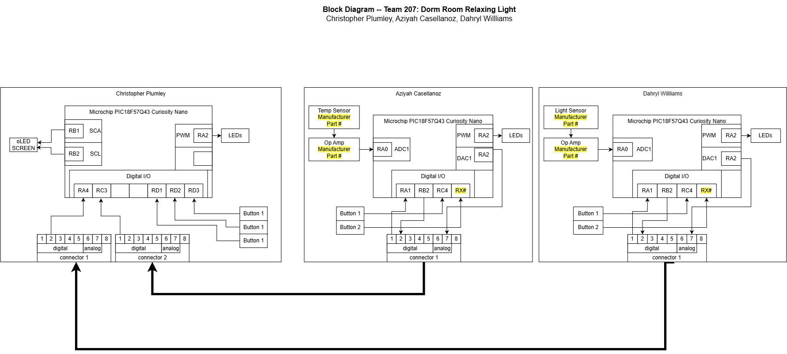

## Introduction

**Bold Text**
_Italic Text_
**_Bold and Italic Text_**

## Research Question

* Bullet Point 1
* Bullet Point 2
* Bullet Point 3

## Images
**Figure 1:** Team 207 Block Diagram 
  
[Drawio.com](https://app.diagrams.net/#G1_G6MJIzGkZMXay39FLlBgE4gDPBz6y6s#%7B%22pageId%22%3A%22D7A3hRXi8sjnXgM3Vncy%22%7D)
<!-- 
  
**Figure 3:** Innovation Showcase Spring '25, where the products were a STEM-themed display that demonstrates a single scientific/engineering concept with the intended user of K-12 students interested in learning about science, technology, engineering, or math. -->

## Results

1. Numbered Point 1
1. Numbered Point 2
1. Numbered Point 3

## Conclusions and Future Work

## External Links

[example link to idealab](https://idealab.asu.edu)

## Results

1. Numbered Point 1
1. Numbered Point 2
1. Numbered Point 3

## Conclusions and Future Work

## External Links

[example link to idealab](https://idealab.asu.edu)

## References

